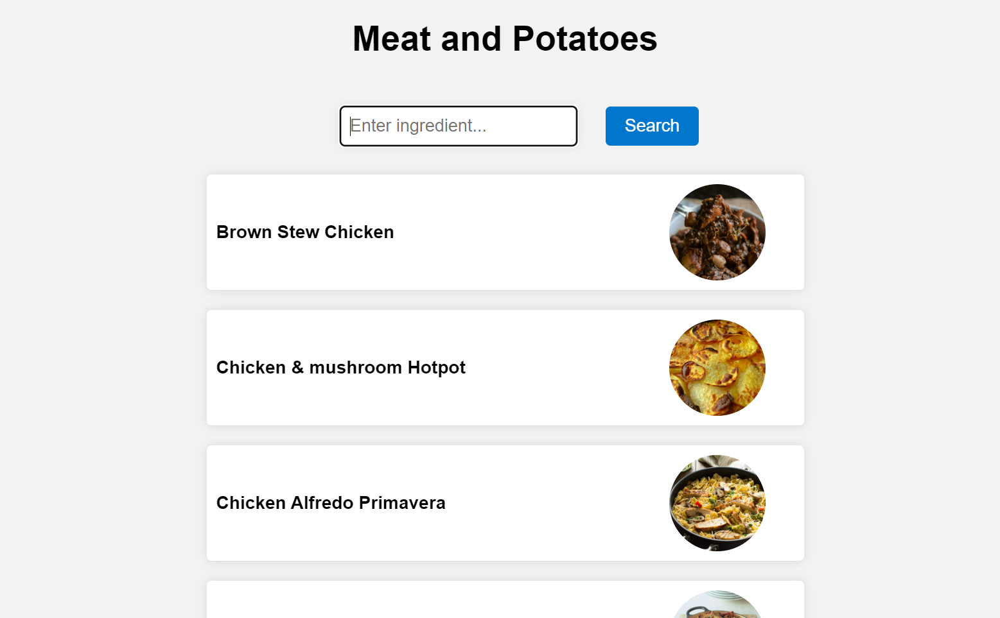

# Hackathon #6 - Recipe generator app

###### April 2023

A React app that allows a user to type in an ingredient and recieve recipes containing that ingredient.

## Screenshots

## Motivation

This week's hackathon task was to select an API, ideate and plan out an MVP, and then build it using React. As a team, Evangeline Amoura, Chris B and I decided to build an app that allows a user to type in an ingredient and receive a list of recipes that include that ingredient.

## Lessons Learned

Building on the previous weeks React skills, this more complicated project allowed me to cement those skills and venture into more complicated code.

Main lessons learned:

- Create at least one good quality user story - and keep this user in mind at all stages.
- Begin with minimum functionality and then build on that.
- Managing states and where to place them - do not forget to go back to the component tree and update it before adding new functionality in order to keep track of all the moving parts.

## Tech Stack

**Client:** React, JavaScript, HTML, CSS

## Installation and Setup Instructions

You will need `node` and `npm` installed on your machine.

Clone the repo:

`https://github.com/anjiqbal/meat-and-potatoes`

Install the required npm modules:

`npm install`

Start the application:

`npm start`

## Improvements

Potential future improvements:

- Write some tests to check functionality from the point of view of a user.
- Split out the ingredients list and recipe so that it is easier to read.
- Add some CSS that eases the transition when a user clicks on a meal to open it or close it.

## Usage

1. Type in an ingredient and press enter or click search.

2. Click on a meal to expand it to see ingredients and recipes. Click on it again to close it.

## Collaborators
